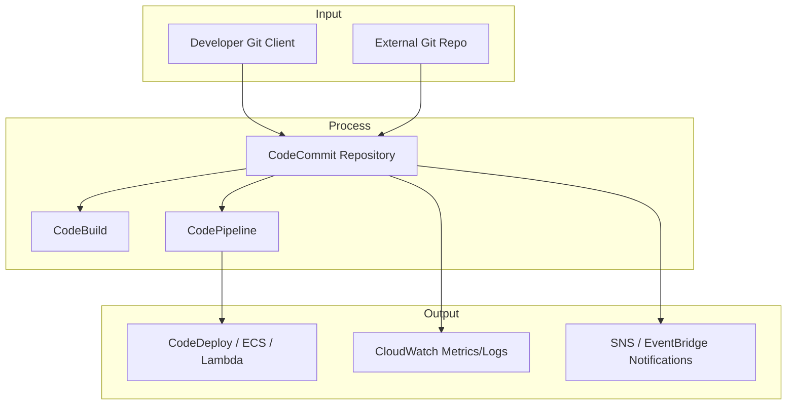

# CodeCommit

## Definition

CodeCommit is a secure, scalable, and fully managed source control service that hosts private Git repositories. It integrates with AWS CI/CD services and provides features like branch management, pull requests, and encryption at rest and in transit, allowing teams to collaborate on code without managing their own Git servers.

## Capabilities & Where to Configure

| Capability & Description                                                                           | Pertinent Setting / Location                                   |
| -------------------------------------------------------------------------------------------------- | -------------------------------------------------------------- |
| **Private Git Repositories** — Host secure, fully managed repositories for code and configuration. | **AWS CodeCommit Console → Repositories → Create repository**  |
| **Branch Management** — Create, delete, and protect branches with pull request workflows.          | **CodeCommit Console → Repository → Branches / Pull requests** |
| **Pull Requests** — Facilitate code reviews and discussion before merging changes.                 | **CodeCommit Console → Repository → Pull requests**            |
| **Access Control & IAM Integration** — Fine-grained permissions using IAM policies and roles.      | **CodeCommit Console → Repository → Permissions / IAM**        |
| **Encryption at Rest & in Transit** — All repository data is encrypted automatically.              | **AWS Managed**                                                |
| **Notifications & Triggers** — Notify via SNS, Lambda, or CloudWatch Events on repository changes. | **CodeCommit Console → Repository → Triggers / EventBridge**   |
| **Webhooks / CI/CD Integration** — Integrate with CodePipeline, Jenkins, or other CI/CD tools.     | **CodeCommit Console → Repository → Connect to pipeline**      |
| **Git Compatibility** — Supports standard Git commands and Git clients.                            | **CodeCommit Docs → Git Setup Instructions**                   |
| **Repository Cloning & Migration** — Clone repos locally or migrate from external Git services.    | **CodeCommit Console → Repository → Clone URL**                |
| **Audit Logging** — Track repository activity via CloudTrail.                                      | **CloudTrail Console → Logs for CodeCommit**                   |

## Common Integrations

**Input:**

* Developers’ local Git clients
* External Git repositories (for migration)

**Process:**

* CodeCommit repository (source code storage & versioning)
* CodeBuild (CI builds)
* CodePipeline (CI/CD orchestration)

**Output:**

* CodeDeploy / ECS / Lambda (deploy artifacts)
* CloudWatch (repository events, metrics)
* SNS / EventBridge (notifications)

## Sample Integration Diagram

## AWS Service Comparisons

<table data-full-width="true"><thead><tr><th>Service</th><th>Similarity</th><th>Difference</th><th>When to Use</th></tr></thead><tbody><tr><td><strong>GitHub (AWS Integration)</strong></td><td>Both host Git repositories and support pull requests.</td><td>GitHub is a global SaaS with community repos and marketplace integrations.</td><td>Use when you want community collaboration or SaaS-hosted Git with CI/CD hooks.</td></tr><tr><td><strong>GitLab (AWS Integration)</strong></td><td>Provides Git repository hosting and CI/CD pipelines.</td><td>GitLab includes issue tracking, built-in CI/CD, and self-hosted option.</td><td>Use when you want integrated DevOps platform with Git hosting and pipelines.</td></tr><tr><td><strong>Bitbucket</strong></td><td>Git-based source control, branch management, and pull requests.</td><td>SaaS or self-hosted, integrates with Jira and Atlassian ecosystem.</td><td>Use for teams using Atlassian products or cloud-hosted Git repos.</td></tr><tr><td><strong>AWS S3 (Versioned)</strong></td><td>Can store code artifacts with versioning.</td><td>Not a Git repository; lacks Git features like branching or pull requests.</td><td>Use only for artifact storage, not active source code collaboration.</td></tr></tbody></table>

## Cross-Cloud Equivalents

| Cloud     | Service                   | Similarity                                                                      | Difference                                                                            |
| --------- | ------------------------- | ------------------------------------------------------------------------------- | ------------------------------------------------------------------------------------- |
| **Azure** | Azure Repos               | Fully managed Git repositories with pull requests and branch policies.          | Integrated tightly with Azure DevOps pipelines; full Microsoft ecosystem integration. |
| **GCP**   | Cloud Source Repositories | Managed Git repositories hosted in GCP with Git commands and CI/CD integration. | Smaller ecosystem than GitHub; integrates with Google Cloud Build and Cloud Deploy.   |
