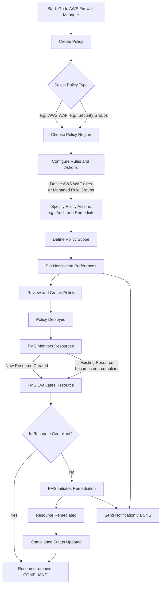

# Security Policies

## Definition

An AWS Firewall Manager policy is a configuration template that centrally defines and enforces security rules across accounts and resources within an AWS Organization, automatically applying and auditing compliance. Five Use Cases:

1. Standardizing WAF protection: Automatically deploys and updates AWS WAF web ACLs across all Application Load Balancers (ALBs), API Gateways, and CloudFront distributions.
2. Centralizing network firewall: Manages AWS Network Firewall rules to filter network traffic in Amazon VPCs across the organization from a single administrator account.
3. Auditing and managing security groups: Defines baseline security group rules, audits existing security groups for overly permissive configurations, and enforces compliance.
4. Implementing DNS filtering: Applies Amazon Route 53 Resolver DNS Firewall rules to block DNS queries for malicious domains across VPCs.
5. Automating DDoS protection: Automatically applies AWS Shield Advanced protection to specified resources across multiple accounts for enhanced DDoS defense.&#x20;

## Most-Used Settings

* Policy type: Specifies the service to manage (e.g., AWS WAF, AWS Network Firewall, security groups).
* Scope: Defines the target for the policy, including accounts, Organizational Units (OUs), resource types (e.g., `AWS::ElasticLoadBalancingV2::LoadBalancer`), and resource tags.
* Action: Configures whether to automatically remediate non-compliant resources or to only audit and notify.
* Rule groups/Rules: Specifies the set of rules or protections to enforce, which are often defined in external rule groups.
* Tags: Uses resource tags to include or exclude specific resources from the policy's scope.&#x20;

