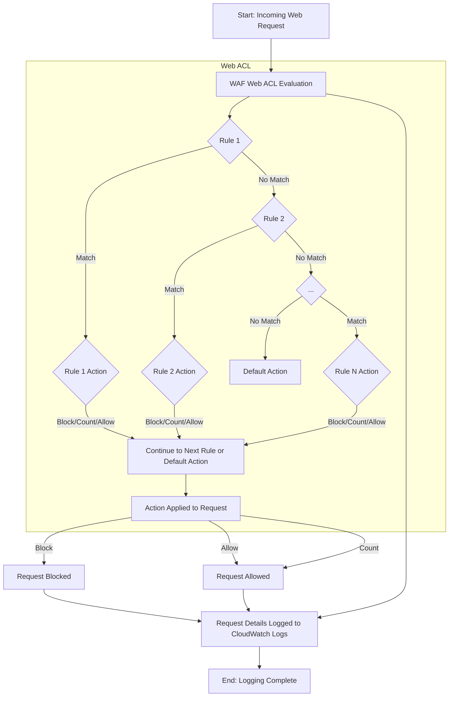

# WAF

AWS WAF is a web application firewall that protects web applications and APIs against common exploits and bot traffic by monitoring HTTP(S) requests. It filters traffic based on rules you define within a Web ACL. Five Use Cases:

1. Block common web exploits: Prevents SQL injection, cross-site scripting (XSS), and other vulnerabilities listed in the OWASP Top 10.
2. Mitigate bot traffic: Monitors, blocks, or rate-limits malicious scrapers, scanners, and pervasive botnets.
3. Implement rate-based throttling: Automatically blocks or challenges clients exceeding a configured request threshold to protect against Layer 7 DDoS attacks.
4. Enforce access control: Uses IP address lists, geographical restrictions, or HTTP request characteristics to allow or block traffic.
5. Prevent account takeover: A managed rule group monitors and protects login pages against credential stuffing and brute force attempts.&#x20;

## Most-Used Settings

* Web ACL: The top-level container for all rules and the default action (allow or block) for unmatched requests.
* Rules: Individual statements within a Web ACL that specify conditions (e.g., IP address, headers) and actions (allow, block, count, or challenge).
* AWS Managed Rules: Pre-built, maintained rule groups for common threats, which are easier to implement than custom rules.
* Rate-based rules: Configurable rules to limit traffic from sources that exceed a defined request rate over a 5-minute period.
* Logging: Enables detailed logging of web requests and rule evaluations to Amazon S3 or CloudWatch Logs for monitoring and tuning.&#x20;

## Flowchart

