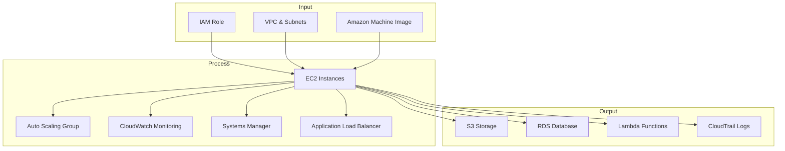

# EC2

## **Description**

Amazon EC2 is a web service that provides secure, resizable virtual servers (instances) in the cloud. It allows users to quickly scale compute capacity up or down, choose from multiple instance families (general purpose, compute-optimized, memory-optimized, GPU, etc.), and integrate tightly with other AWS services.

## Capabilities

| Capability & Description                                                                                   | Pertinent Setting                   |
| ---------------------------------------------------------------------------------------------------------- | ----------------------------------- |
| **Instance Types** — Choose hardware configurations (vCPU, memory, storage, networking).                   | Launch Instance → Instance type     |
| **AMI (Amazon Machine Image)** — Preconfigured templates with OS and software.                             | Launch Instance → AMI               |
| **EBS Volumes** — Persistent block storage attached to EC2 instances.                                      | Launch Instance → Storage           |
| **Security Groups** — Virtual firewalls controlling inbound/outbound traffic.                              | Networking → Security group         |
| **Elastic IPs** — Static, public IPv4 addresses for instances.                                             | Networking → Elastic IP             |
| **Auto Scaling** — Adjusts instance count automatically based on demand.                                   | Auto Scaling Group                  |
| **Placement Groups** — Controls instance placement for high availability, low latency, or high throughput. | Advanced settings → Placement group |
| **Instance Metadata & IAM Roles** — Provide temporary credentials and configs securely.                    | Instance settings → IAM role        |
| **Spot & Reserved Instances** — Pricing models for cost optimization.                                      | Purchase Options                    |
| **Elastic Network Interfaces (ENI)** — Attach multiple network interfaces to instances.                    | Networking → ENI                    |

## **Common Integrations**

* **Input:** IAM (for instance roles), AMI, VPC/Subnets
* **Process:** Auto Scaling, CloudWatch (monitoring), Systems Manager (automation), Elastic Load Balancing
* **Output:** S3 (for data), RDS (databases), Lambda (event-driven compute), CloudTrail (audit)

## **Description**

## **Best Practices**

* Use IAM roles instead of hardcoding credentials.
* Enable detailed CloudWatch monitoring.
* Use Auto Scaling groups for elasticity.
* Apply security groups and NACLs with least privilege.
* Use Reserved/Spot Instances for cost optimization.
* Regularly patch and automate using Systems Manager.

## **AWS Service Comparisons**

| Service                              | Similarity                        | Difference                                              | When to Use                                      |
| ------------------------------------ | --------------------------------- | ------------------------------------------------------- | ------------------------------------------------ |
| **ECS (Elastic Container Service)**  | Runs applications on AWS compute. | Abstracts EC2 into containers, no OS management needed. | Use when running containerized workloads.        |
| **EKS (Elastic Kubernetes Service)** | Runs workloads on compute.        | Managed Kubernetes control plane.                       | Use for Kubernetes-based workloads.              |
| **Lambda**                           | Executes compute workloads.       | Serverless, event-driven, no servers to manage.         | Use for lightweight, event-driven tasks.         |
| **Lightsail**                        | Provides compute instances.       | Simplified EC2 with bundled networking and storage.     | Use for small projects, websites, or prototypes. |

## **Cross-Cloud Equivalents**

| Cloud     | Equivalent Service     | Difference                                                       |
| --------- | ---------------------- | ---------------------------------------------------------------- |
| **Azure** | Azure Virtual Machines | Similar flexibility, but integrated with Azure Resource Manager. |
| **GCP**   | Google Compute Engine  | Similar VM service, supports custom machine types more flexibly. |
