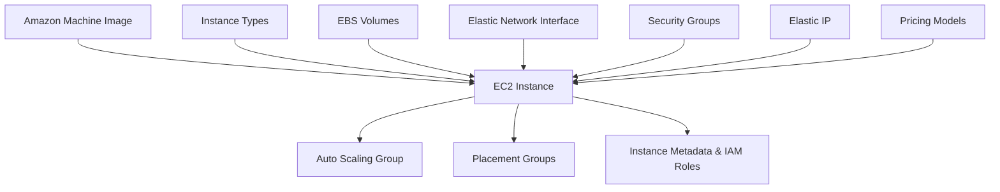

# Components

Perfect, let’s break down **EC2 Components** just like you asked earlier:

***

## **Instance Types**

[instance-types.md](instance-types.md "mention")

EC2 offers different categories of instances (General Purpose, Compute Optimized, Memory Optimized, Storage Optimized, GPU/Accelerated). Each is tuned for different workloads.

* **Use Case Example:** A `t3.micro` instance for a small web server; a `p4d` instance for machine learning training.

***

## &#x20;**Amazon Machine Images (AMIs)**&#x20;

[ami](ami/ "mention")

An AMI is a template that contains an operating system and optional preinstalled software. It’s used to launch new instances consistently.

* **Use Case Example:** Using an Ubuntu AMI for general Linux workloads, or a custom AMI with your application pre-installed for scaling.

***

#### **3. Elastic Block Store (EBS) Volumes**

Persistent block storage that can be attached to EC2 instances. Data remains even if the instance is stopped.

* **Use Case Example:** Hosting a database on an EC2 instance with `io2` EBS volumes for high IOPS.

***

#### **4. Security Groups**

Virtual firewalls that control inbound and outbound traffic for instances.

* **Use Case Example:** Allow inbound HTTPS (443) for a web app, but block all other traffic except SSH from your IP.

***

#### **5. Elastic IPs (EIP)**

Static IPv4 addresses that you can assign to instances for consistent public reachability.

* **Use Case Example:** Assigning an Elastic IP to a web server that must always be reachable at the same IP, even if the instance is restarted.

***

#### **6. Auto Scaling Groups (ASG)**

Automatically adjusts the number of EC2 instances based on demand, keeping costs and performance balanced.

* **Use Case Example:** Scaling out more web servers during Black Friday traffic, then scaling back down at night.

***

#### **7. Placement Groups**

Control how EC2 instances are physically placed within the AWS infrastructure (Clustered, Spread, Partition).

* **Use Case Example:** HPC workloads in a Cluster Placement Group to achieve low-latency interconnect between nodes.

***

#### **8. Instance Metadata & IAM Roles**

Metadata service provides information about the instance, while IAM roles give temporary credentials for AWS services without embedding secrets.

* **Use Case Example:** An EC2 instance running an app that retrieves objects from S3 using an IAM role, instead of storing AWS keys in code.

***

## **Pricing Models (On-Demand, Reserved, Spot, Savings Plans, Dedicated)**

[pricing](pricing/ "mention")

Defines how you pay for compute usage.

* **Use Case Example:** Run a quick dev test with On-Demand, commit to a 3-year RI for a production database, or use Spot for a fault-tolerant batch job.

***

#### **10. Elastic Network Interfaces (ENI)**

Virtual network cards that can be attached to an instance, enabling multiple IP addresses, security groups, or network monitoring.

* **Use Case Example:** Using a second ENI for a management network separated from production traffic.

***

## **EC2 Components Flow**

Here’s how they connect conceptually:

