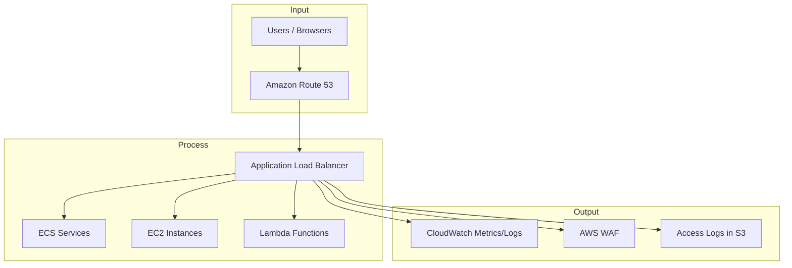

# Application Load Balancer

## **Description**

ALB is an elastic, fully managed load balancer that operates at the application layer (HTTP/HTTPS). It routes requests based on advanced rules like host/path, supports microservices and containers, and integrates natively with AWS services for scalable web architectures.

## Capabilities & Where to Configure

| Capability & Description                                                                                                         | Pertinent Setting / Location                                      |
| -------------------------------------------------------------------------------------------------------------------------------- | ----------------------------------------------------------------- |
| **Listener Rules** — Define how incoming traffic is routed based on conditions like host, path, HTTP headers, or query strings.  | **EC2 Console → Load Balancers → Listeners**                      |
| **Target Groups** — Register EC2, ECS, EKS, or Lambda as destinations for routed traffic.                                        | **EC2 Console → Target Groups**                                   |
| **Path/Host-based Routing** — Direct traffic to different services based on URL path (/api vs /app) or domain (api.example.com). | **EC2 Console → Load Balancers → Listeners → Rules**              |
| **Health Checks** — Continuously monitor registered targets and only route traffic to healthy ones.                              | **Target Groups → Health checks**                                 |
| **SSL/TLS Termination** — Terminate HTTPS at the ALB to offload certificates from backend services.                              | **Load Balancer → Listeners → Add HTTPS (ACM certificate)**       |
| **WebSocket & HTTP/2 Support** — Enable real-time bidirectional communication and optimized performance.                         | **Load Balancer → Attributes**                                    |
| **Cross-Zone Load Balancing** — Evenly distribute traffic across all healthy targets in all enabled AZs.                         | **Load Balancer → Attributes → Cross-zone load balancing**        |
| **Access Logs & Monitoring** — Send detailed request logs to S3 and metrics to CloudWatch.                                       | **Load Balancer → Attributes → Access logs / CloudWatch Metrics** |
| **WAF Integration** — Protect applications from common web exploits by attaching AWS WAF.                                        | **Load Balancer → Integrated Services → AWS WAF**                 |
| **Authentication (OIDC/Cognito)** — Authenticate users before requests reach backend services.                                   | **Load Balancer → Listener Rules → Authenticate action**          |

## Common Integrations

**Input:**

* Amazon Route 53 (DNS)
* Clients (HTTP/HTTPS requests)

**Process:**

* Amazon ECS / EKS (containers)
* EC2 Instances
* Lambda (serverless targets)

**Output:**

* Amazon CloudWatch (metrics/alarms)
* AWS WAF (security filtering)
* S3 (access logs)

## Sample Integration Diagram

## AWS Service Comparisons

| Service                          | Similarity                                                | Difference                                                                                                                               |
| -------------------------------- | --------------------------------------------------------- | ---------------------------------------------------------------------------------------------------------------------------------------- |
| **Network Load Balancer (NLB)**  | Both distribute traffic and integrate with target groups. | NLB operates at Layer 4 (TCP/UDP), ideal for ultra-low latency, millions of requests/sec. No advanced routing rules.                     |
| **Classic Load Balancer (CLB)**  | Provides basic load balancing for HTTP/HTTPS and TCP.     | Legacy service, lacks advanced routing (host/path), limited features. Not recommended for new apps.                                      |
| **Gateway Load Balancer (GWLB)** | Balances traffic across appliances like firewalls.        | Focused on Layer 3/4 for security appliances, not application-aware.                                                                     |
| **Amazon API Gateway**           | Both can front-end APIs and route requests.               | API Gateway adds request transformation, throttling, caching, and is serverless-first. ALB is simpler, cost-effective for microservices. |

## Cross-Cloud Equivalents

| Cloud     | Service                            | Similarity                                       | Difference                                                           |
| --------- | ---------------------------------- | ------------------------------------------------ | -------------------------------------------------------------------- |
| **Azure** | Azure Application Gateway          | Layer 7 routing, SSL offload, WAF integration.   | Tighter integration with Azure AD and hybrid networks.               |
| **Azure** | Azure Load Balancer                | Basic Layer 4 balancing.                         | No app-aware features like path/host routing.                        |
| **GCP**   | Google Cloud HTTP(S) Load Balancer | Global, Layer 7 load balancing with SSL offload. | Fully global by default, integrates with Google’s CDN and edge POPs. |
| **GCP**   | Google Cloud TCP/UDP Load Balancer | Layer 4 traffic distribution.                    | No Layer 7 features, mainly for raw networking.                      |
