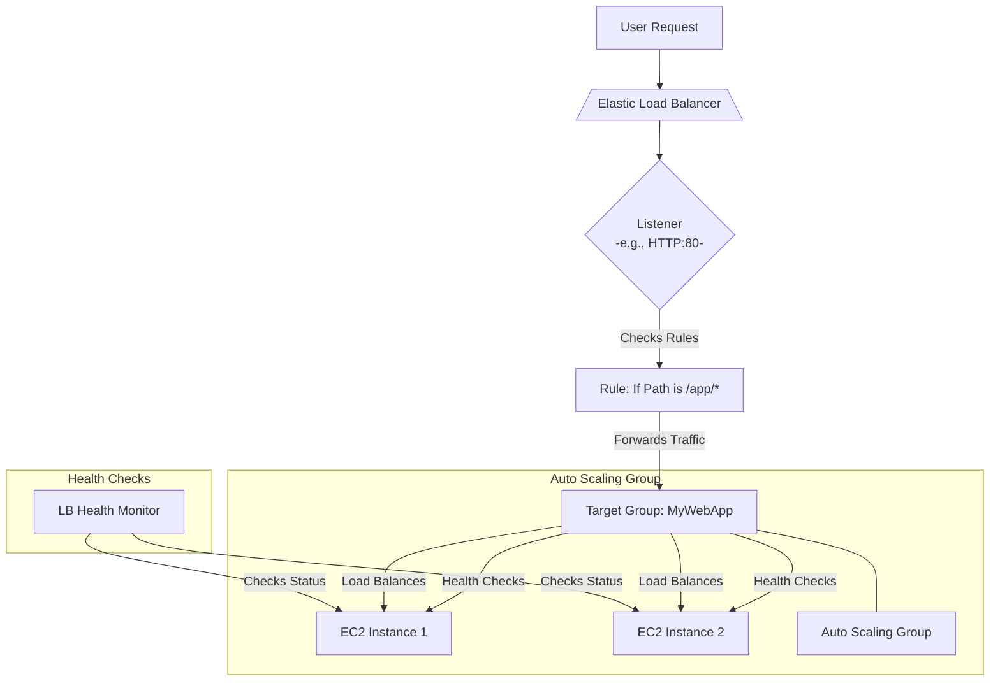

# Target Group

## Definition

An AWS target group is a logical grouping of targets, such as EC2 instances, IP addresses, or Lambda functions, that receive traffic from a load balancer. The target group and its associated load balancer enable high availability, scalability, and automated health management for your applications. How target groups workAn AWS Elastic Load Balancer (ELB) uses listeners and rules to route incoming traffic to target groups.&#x20;

The general flow is:&#x20;

1. Request comes in: A user makes a request to the load balancer's DNS name.
2. Listener checks traffic: The load balancer's listener, configured for a specific protocol (e.g., HTTP, HTTPS) and port, checks for incoming traffic.
3. Rule is matched: The listener evaluates its rules to determine which target group should receive the request. Rules can be based on criteria like the URL path or host headers.
4. Traffic is forwarded: Once a rule is met, the load balancer forwards the request to the corresponding target group.
5. Traffic is distributed: The target group distributes the incoming traffic among its healthy, registered targets.&#x20;

## Flow

## Features

* Health checks: Target groups are used to define health check settings. The load balancer continuously monitors the health of registered targets to ensure traffic is only routed to those that are healthy and responsive.
* Multiple targets: You can register multiple targets with a single target group. You can also register a single target with multiple different target groups.
* Integration with Auto Scaling: A target group can be attached to an Auto Scaling group. As the Auto Scaling group scales in or out, it automatically registers new targets and deregisters old ones.
* Support for various targets: A target group can route traffic to different types of compute resources, depending on the load balancer type.
  * Instances: EC2 instances identified by instance ID.
  * IP addresses: Specific IP addresses, including resources outside of AWS.
  * Lambda functions: For routing HTTP requests to serverless functions.
* Advanced routing for ALBs: For Application Load Balancers, target groups enable advanced routing rules based on content, like sending traffic to different target groups based on the request's URL path.
* Blue/Green deployments: You can use multiple weighted target groups to control traffic distribution between different versions of an application. For example, you can send 80% of traffic to one version and 20% to another.&#x20;
