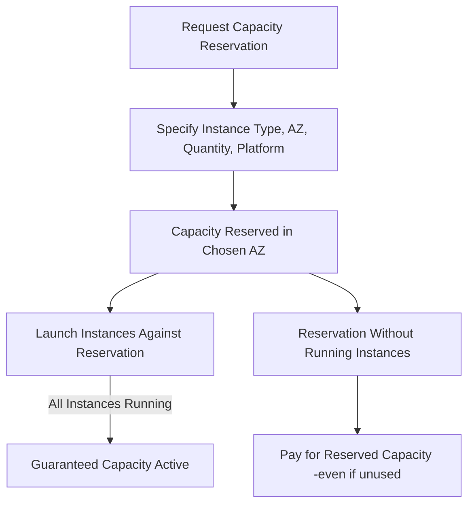

# Capacity Reservation

### **What is Capacity Reservation in EC2?**

* A **Capacity Reservation** ensures that a specific number of instances of a chosen type (instance type, AZ, tenancy, platform) are always available for you in a given Availability Zone.
* Unlike Spot, where you risk losing capacity, Capacity Reservation **locks capacity for you** even if you’re not using it.

***

### **Types of Capacity Reservations**

1. **On-Demand Capacity Reservations (ODCR)**
   * You pay On-Demand rates.
   * You **reserve capacity but don’t get a discount**.
   * Useful for short-term but guaranteed workloads.
2. **Zonal Reserved Instances (RI)**
   * A Reserved Instance tied to a specific AZ also provides a capacity reservation.
   * You get both **discounts** and **guaranteed capacity**.
3. **Savings Plans + ODCR**
   * You can pair Savings Plans (discounts) with On-Demand Capacity Reservations (guaranteed capacity).
   * Gives flexibility + cost efficiency.

***

### **How They Compare to Spot**

| Feature          | **Spot**                           | **Capacity Reservation**                               |
| ---------------- | ---------------------------------- | ------------------------------------------------------ |
| **Pricing**      | Up to 90% discount                 | On-Demand pricing (unless paired with RI/Savings Plan) |
| **Availability** | Not guaranteed, can be interrupted | Guaranteed capacity in chosen AZ                       |
| **Use Case**     | Fault-tolerant, flexible workloads | Mission-critical apps needing guaranteed resources     |
| **Example**      | Batch processing, ML training      | Healthcare app needing instances during COVID peak     |

***

### **Flow of Capacity Reservation**

***

#### **Key Notes**

* If you don’t launch instances against your reservation, you still pay for it.
* Best for **mission-critical, scheduled workloads**, or when you know you’ll need guaranteed compute at a specific time (e.g., Black Friday, product launch).
* You can **cancel or modify** reservations when they’re no longer needed.

***

👉 Do you want me to **add Capacity Reservation as another pricing option** to the **EC2 pricing matrix** I made earlier, so you can see it alongside On-Demand, Spot, RI, and Savings Plans?
