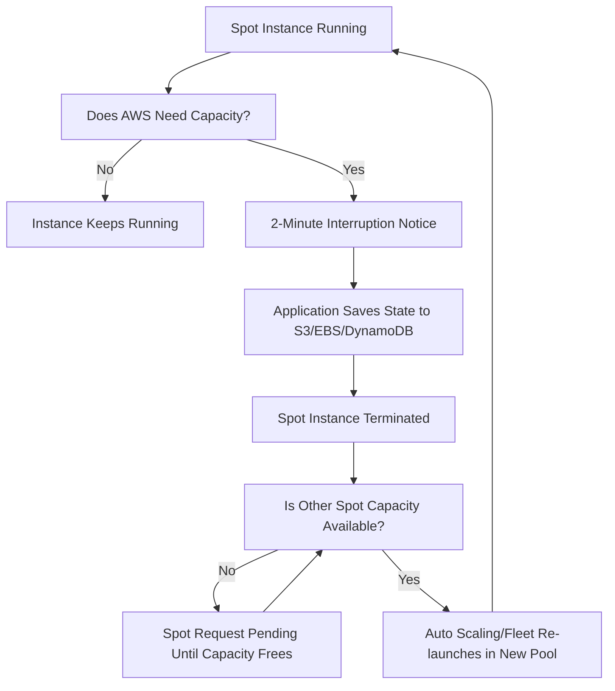

# Spot Instances

Great question — this goes into the **quirks of EC2 Spot Instances** when you want to scale large (like 100 units).

***

### **What happens when Spot Instances are terminated by AWS?**

1. **Interruption notice:**
   * AWS gives you a **2-minute warning** before reclaiming your instance.
   * You can catch this via the [instance metadata endpoint](http://169.254.169.254/latest/meta-data/spot/termination-time) or CloudWatch Events.
2. **Termination:**
   * Once 2 minutes pass, the instance is stopped or terminated (depending on what you set).
   * Any unsaved data in ephemeral storage is lost, but attached EBS volumes persist.
3. **Capacity loss:**
   * Your application suddenly has fewer compute resources (e.g., you drop from 100 → 82 instances).
   * This is why Spot is **best combined with Auto Scaling groups** and **mixed instance policies**.

***

### **How soon can Spot Instances be spun up again?**

* **Immediately, if capacity is available again** in the same pool.
  * Spot instances are launched from “pools” (a pool = instance type + OS + AZ).
  * If capacity frees up in that pool, your Auto Scaling group can grab it back right away.
* **But not guaranteed**:
  * If demand is high (other customers are bidding/using capacity), your request might remain unfulfilled.
  * Some pools are very stable (cheap and plentiful), others are volatile.

***

### **Strategies to Minimize Impact**

1. **Diversify pools:**
   * Don’t request 100 units of the _same instance type/AZ_.
   * Instead, spread across multiple families, sizes, and AZs.
   * Example: 25 `m5.large` + 25 `m5a.large` + 25 `m4.large` + 25 `t3.large`.
2. **Use Spot Fleet or EC2 Auto Scaling with “capacity-optimized” allocation strategy:**
   * AWS picks the most stable pools with lowest interruption rate.
3. **Mix with On-Demand or Reserved:**
   * Run a baseline (say 20 instances On-Demand) and burst to 80 more with Spot.
   * This way your app won’t collapse if Spot capacity disappears.
4. **Checkpointing & fault tolerance:**
   * Apps should save state frequently (to S3, EBS, DynamoDB, etc.) so lost nodes don’t lose progress.

***

### **In practice**

* Spot instances can be **re-provisioned within minutes** if other pools are available.
* If you stick to only one pool, you might wait indefinitely.
* If you diversify, you’ll almost always get capacity back fairly quickly.

***

## Lifecycle

