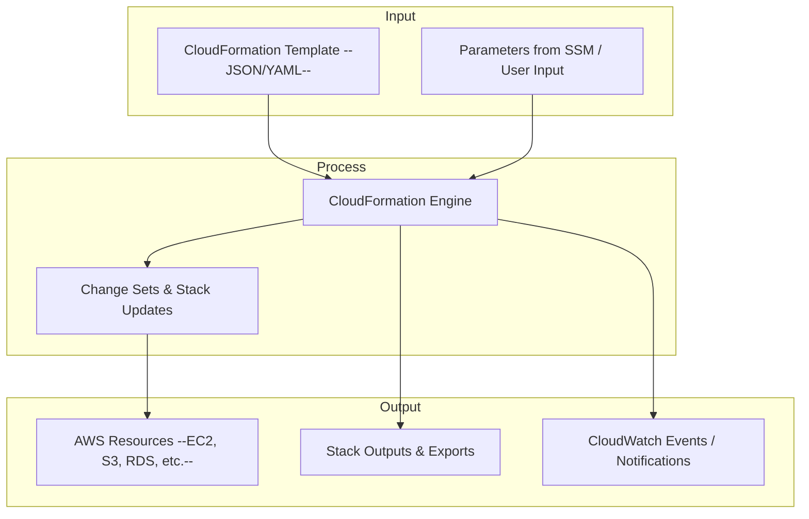

# CloudFormation

## **Amazon Docs**



### Concepts





### Troubleshooting





## **Description**

CloudFormation allows you to define your AWS infrastructure using templates (JSON or YAML). You can create, update, and delete stacks of resources in a predictable and repeatable way, enabling automated deployment, versioning, and rollback of complex architectures.

***

## Capabilities & Where to Configure

| Capability & Description                                                                               | Pertinent Setting / Location                                      |
| ------------------------------------------------------------------------------------------------------ | ----------------------------------------------------------------- |
| **Stacks** — Groups of AWS resources managed as a single unit.                                         | **CloudFormation Console → Stacks → Create Stack**                |
| **Templates** — Define infrastructure using JSON or YAML.                                              | **CloudFormation Console → Templates → Upload or Use Designer**   |
| **Stack Updates** — Modify stacks safely, with rollback on errors.                                     | **CloudFormation Console → Stacks → Update**                      |
| **Change Sets** — Preview proposed changes before applying updates.                                    | **CloudFormation Console → Stacks → Create Change Set**           |
| **Stack Sets** — Deploy stacks across multiple accounts and regions.                                   | **CloudFormation Console → Stack Sets**                           |
| **Resource Dependencies** — Automatically handles ordering of resource creation.                       | **Defined in templates using `DependsOn` or resource references** |
| **Outputs & Exports** — Share values from one stack with other stacks.                                 | **CloudFormation Console → Stacks → Outputs**                     |
| **Drift Detection** — Detect if resources were modified outside CloudFormation.                        | **CloudFormation Console → Stacks → Detect Drift**                |
| **Stack Policies** — Restrict which resources can be updated during stack changes.                     | **CloudFormation Console → Stacks → Stack Policy**                |
| **Integrations** — Integrates with CodePipeline, CloudTrail, and Config for automation and monitoring. | **CloudFormation Console / API**                                  |

***

## Common Integrations

**Input:**

* CloudFormation templates (JSON/YAML)
* Parameter values (from SSM Parameter Store, Secrets Manager, or input during stack creation)

**Process:**

* CloudFormation engine (creates, updates, or deletes resources)
* Change sets (previews and validates updates)

**Output:**

* AWS resources (EC2, S3, Lambda, RDS, VPCs, etc.)
* Outputs exported to other stacks
* CloudWatch events for stack status

***

## Sample Integration Diagram

## AWS Service Comparisons

<table data-full-width="true"><thead><tr><th>Service</th><th>Similarity</th><th>Difference</th><th>When to Use</th></tr></thead><tbody><tr><td><strong>Terraform</strong></td><td>Infrastructure-as-Code, multi-cloud support.</td><td>CloudFormation is AWS-native; Terraform supports multiple clouds.</td><td>Use CloudFormation when working primarily in AWS and want native integration.</td></tr><tr><td><strong>AWS CDK</strong></td><td>Define AWS infrastructure using code.</td><td>CDK allows programming languages (Python, TypeScript, etc.) instead of declarative templates.</td><td>Use CDK for programmatic IaC with complex logic.</td></tr><tr><td><strong>Elastic Beanstalk</strong></td><td>Automates resource provisioning for applications.</td><td>Beanstalk abstracts infrastructure; CloudFormation gives full control.</td><td>Use CloudFormation for complete control over resources and dependencies.</td></tr><tr><td><strong>OpsWorks</strong></td><td>Deploy and manage infrastructure.</td><td>OpsWorks is Chef/Puppet-based; CloudFormation is declarative IaC.</td><td>Use CloudFormation for declarative templates and automated stack management.</td></tr></tbody></table>

***

## Cross-Cloud Equivalents

| Cloud                       | Service                                | Similarity                                            | Difference                                                                                    |
| --------------------------- | -------------------------------------- | ----------------------------------------------------- | --------------------------------------------------------------------------------------------- |
| **Azure**                   | Azure Resource Manager (ARM Templates) | Declarative templates for infrastructure deployment.  | CloudFormation is AWS-native; ARM is Azure-native.                                            |
| **GCP**                     | Deployment Manager                     | Define infrastructure as YAML/JSON templates.         | CloudFormation integrates with AWS services; Deployment Manager integrates with GCP services. |
| **Terraform (Multi-cloud)** | Terraform                              | Multi-cloud IaC tool using HCL language.              | Not native; supports multiple cloud providers via providers.                                  |
| **Azure / GCP**             | Pulumi                                 | Programmatic IaC using languages like Python, JS, Go. | CloudFormation is declarative; Pulumi is code-first.                                          |

***
