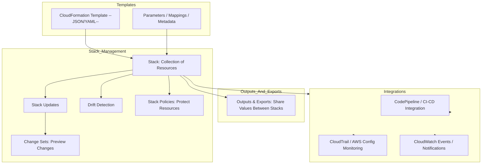
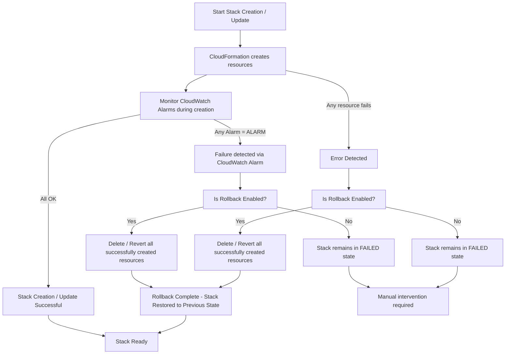

# Components

## Components Connections

## **Stacks**



### Operations





### Rollback





* **Description:** Stacks are the fundamental building blocks in CloudFormation. They are logical containers that group multiple AWS resources together so they can be managed as a single unit. When you create a stack, all the resources defined in the template are provisioned in a coordinated way.
* **Use Case Example:** You can deploy a complete web application environment in one action, including a VPC, subnets, security groups, EC2 instances, and an RDS database. This ensures that every environment is consistent and can be recreated reliably.
* **Rollback Flow**

## **Templates**

* **Description:** Templates are the blueprint for your stacks. Written in JSON or YAML, they define all the resources, parameters, mappings, outputs, and metadata required for your infrastructure. Templates allow you to codify infrastructure and version it just like software code.
* **Use Case Example:** A company can maintain a template for its standard 3-tier web application stack so that developers and DevOps teams can spin up identical staging, testing, and production environments quickly.

## **Stack Updates**

* **Description:** Stack updates allow you to modify existing stacks in a safe manner. CloudFormation handles dependencies and can automatically roll back changes if something goes wrong during the update.
* **Use Case Example:** You need to upgrade an RDS instance in a production stack to a newer version. By using stack updates, you can modify the resource without manually reconfiguring it, and rollback ensures no downtime if the upgrade fails.

## **Direct Updates**



### Operations





When you want to quickly deploy updates to your stack, perform a direct update. With a direct update, you submit a template or input parameters that specify updates to the resources in the stack, and CloudFormation immediately deploys them. If you want to use a template to make your updates, you can modify the current template and store it locally or in an Amazon S3 bucket.

## **Change Sets**



### Operations





* **Description:** Change sets provide a way to preview the impact of proposed changes to a stack before executing them. They let you see which resources will be added, modified, or deleted.
* **Use Case Example:** Before adding a new Lambda function to a production stack, you can create a change set to verify that existing S3 bucket policies won’t be accidentally altered.

## **StackSets**



### Concepts





* **Description:** Stack sets extend CloudFormation by allowing a single stack to be deployed across multiple AWS accounts and regions. This ensures consistent infrastructure at scale in organizations with multiple accounts.
* **Use Case Example:** Roll out a standardized monitoring setup, including CloudWatch alarms and SNS notifications, across all regional accounts in your enterprise organization.

## **Resource Dependencies**

* **Description:** CloudFormation automatically handles the order in which resources are created based on their relationships. This prevents errors that occur if resources are referenced before they exist.
* **Use Case Example:** When deploying EC2 instances that reference a security group, CloudFormation ensures the security group is created first to avoid dependency errors.

## **Outputs & Exports**

* **Description:** Outputs allow you to export values from one stack to be used by other stacks. This enables modularization and inter-stack communication.
* **Use Case Example:** A networking stack exports a VPC ID and subnet IDs, which can then be referenced by an application stack that needs to deploy resources inside that VPC.

## **Drift Detection**



### Operations





* **Description:** Drift detection identifies any changes made to stack resources outside of CloudFormation, such as manual edits in the console or via APIs. This ensures your infrastructure stays aligned with the defined templates.
* **Use Case Example:** Discover that a production S3 bucket policy was modified manually, which could cause security or compliance issues, and take corrective action.

## **Stack Policies**

* **Description:** Stack policies allow you to restrict which resources can be updated during stack updates, protecting critical infrastructure from accidental changes.
* **Use Case Example:** Prevent accidental deletion of a production RDS database when updating a stack, while still allowing other resources like EC2 or Lambda to be updated.

## **Integrations**

* **Description:** CloudFormation integrates with other AWS services like CodePipeline for CI/CD, CloudTrail for auditing, and AWS Config for compliance tracking. This allows you to automate deployments and maintain governance.
* **Use Case Example:** Automatically deploy infrastructure changes when code is pushed to a repository, while ensuring all changes are logged and compliant with organizational policies.
