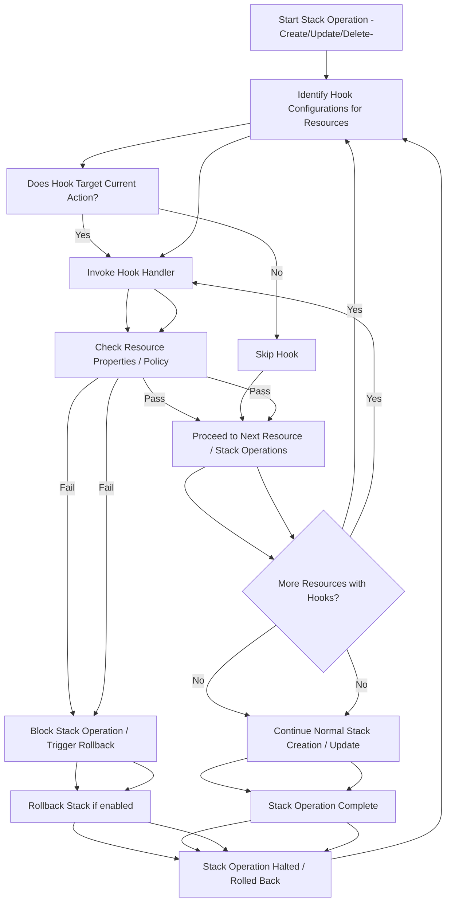

# Hooks

## AWS Docs



### Concepts





### Guard Hooks





CloudFormation hooks have **limited response capabilities** - they primarily serve as **validation and enforcement mechanisms** rather than automatic correction tools. Here's how they work:

## Hook Response Actions

CloudFormation hooks can respond in **two ways** when they detect issues:

#### 1. **WARN Mode**

* Issues warnings to users but **allows the operation to continue**
* Useful for non-critical validations or informational checks
* The stack operation proceeds despite the hook detecting non-compliance

#### 2. **FAIL Mode**

* **Prevents the action from proceeding entirely**
* Stops provisioning resources and can trigger stack rollback
* Helpful for enforcing strict compliance or security policies

## What Hooks Cannot Do

**No Automatic Corrections**: CloudFormation hooks **cannot automatically fix or correct** non-compliant configurations. They can only:

* Inspect and validate resource configurations before provisioning
* Either allow the operation to continue (WARN) or stop it entirely (FAIL)

**No Resource Modification**: Hooks cannot modify the template, change resource properties, or make corrections to bring resources into compliance.

## Hook Capabilities

**Proactive Validation**: Hooks run **immediately before** CloudFormation creates, updates, or deletes stacks or resources, providing early detection of issues.

**Inspection Only**: They can inspect:

* Templates
* Resource configurations
* Change sets
* Stack properties

**Binary Decision**: Hooks make a simple pass/fail decision - they cannot perform remediation actions.

## Alternative Approaches for Corrections

If you need automatic corrections, you would need to implement them **outside of hooks**:

**Custom Resources**: Use Lambda-backed custom resources that can perform corrective actions during stack operations.

**Separate Remediation Process**: Create a separate workflow that:

1. Uses hooks to detect issues (WARN mode)
2. Triggers external remediation processes
3. Re-runs the stack operation after corrections

**Template Preprocessing**: Modify templates before submission to CloudFormation to ensure compliance.

In summary, CloudFormation hooks are **validation and enforcement tools**, not correction mechanisms. They can stop operations or issue warnings, but they cannot automatically fix non-compliant configurations.

