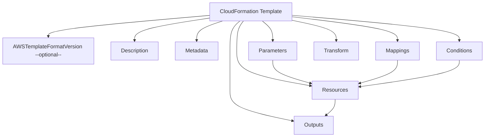

# Template Parts

## AWS Docs



### Reference





A **CloudFormation JSON file** (also YAML, but JSON is just syntax) defines the infrastructure for a stack. It consists of several **core sections**, each with a specific purpose. Here’s a detailed breakdown:

***

## Parts

#### 1. **AWSTemplateFormatVersion** _(optional)_

* **Description:** Specifies the version of the CloudFormation template syntax.
* **Purpose:** Mainly informational; most templates use `"2010-09-09"`.
* **Example:**

```json
"AWSTemplateFormatVersion": "2010-09-09"
```

***

#### 2. **Description** _(optional but recommended)_

* **Description:** Human-readable description of what the template does.
* **Purpose:** Helps maintainers understand the template’s purpose.
* **Example:**

```json
"Description": "CloudFormation template for deploying a 3-tier web application."
```

***

#### 3. **Metadata** _(optional)_

* **Description:** Stores arbitrary data about the template, such as authors, build information, or version info.
* **Purpose:** Useful for tooling and documentation.
* **Example:**

```json
"Metadata": {
    "Author": "DevOps Team",
    "Version": "1.0"
}
```

***

#### 4. **Parameters** _(optional)_

* **Description:** Define input values that can be passed in when creating or updating a stack.
* **Purpose:** Makes templates reusable for different environments or configurations.
* **Example:**

```json
"Parameters": {
    "InstanceType": {
        "Type": "String",
        "Default": "t3.micro",
        "AllowedValues": ["t2.micro","t3.micro","t3.small"],
        "Description": "EC2 instance type"
    }
}
```

***

#### 5. **Mappings** _(optional)_

* **Description:** Static mappings of keys to values used in the template.
* **Purpose:** Simplify selection of configuration values based on region, environment, or other criteria.
* **Example:**

```json
"Mappings": {
    "RegionMap": {
        "us-east-1": {"AMI": "ami-0abcdef12345"},
        "us-west-2": {"AMI": "ami-0123456789abc"}
    }
}
```

***

#### 6. **Conditions** _(optional)_

* **Description:** Logical conditions that control whether certain resources or outputs are created.
* **Purpose:** Enable conditional creation of resources.
* **Example:**

```json
"Conditions": {
    "CreateProdResources": {"Fn::Equals": [{"Ref": "EnvType"}, "prod"]}
}
```

***

#### 7. **Resources** _(required)_

* **Description:** The core section where all AWS resources are defined (EC2, S3, Lambda, RDS, etc.).
* **Purpose:** Specifies the infrastructure to create, along with properties and dependencies.
* **Example:**

```json
"Resources": {
    "MyEC2Instance": {
        "Type": "AWS::EC2::Instance",
        "Properties": {
            "InstanceType": {"Ref": "InstanceType"},
            "ImageId": {"Fn::FindInMap": ["RegionMap", {"Ref": "AWS::Region"}, "AMI"]}
        }
    }
}
```

***

#### 8. **Outputs** _(optional but recommended)_

* **Description:** Exported values from the stack that can be referenced by other stacks or displayed after creation.
* **Purpose:** Useful for sharing resource IDs, IP addresses, or other information.
* **Example:**

```json
"Outputs": {
    "InstanceId": {
        "Description": "ID of the EC2 instance",
        "Value": {"Ref": "MyEC2Instance"},
        "Export": {"Name": "MyEC2InstanceID"}
    }
}
```

***

#### 9. **Transform** _(optional)_

* **Description:** Specifies the use of macros such as **AWS::Include** or **AWS::Serverless** for SAM (Serverless Application Model).
* **Purpose:** Enable template reuse and serverless deployments.
* **Example:**

```json
"Transform": "AWS::Serverless-2016-10-31"
```

***

## Summary of Key Parts

1. **AWSTemplateFormatVersion** – Template version
2. **Description** – Human-readable template purpose
3. **Metadata** – Optional info about template or author
4. **Parameters** – Input values for customization
5. **Mappings** – Static lookup tables
6. **Conditions** – Logic for conditional resource creation
7. **Resources** – Core AWS infrastructure definitions
8. **Outputs** – Exported values from the stack
9. **Transform** – Optional macros for advanced usage

***



## Example Document

```json
{
  "AWSTemplateFormatVersion": "2010-09-09",
  "Description": "Example template demonstrating all CloudFormation parts",
  "Metadata": {
    "Author": "DevOps Team",
    "Version": "1.0"
  },
  "Parameters": {
    "EnvType": {
      "Type": "String",
      "Default": "dev",
      "AllowedValues": ["dev", "prod"],
      "Description": "Environment type"
    }
  },
  "Mappings": {
    "RegionMap": {
      "us-east-1": {"AMI": "ami-0abcdef12345"},
      "us-west-2": {"AMI": "ami-0123456789abc"}
    }
  },
  "Conditions": {
    "CreateProdResources": {"Fn::Equals": [{"Ref": "EnvType"}, "prod"]}
  },
  "Resources": {
    "MyEC2Instance": {
      "Type": "AWS::EC2::Instance",
      "Condition": "CreateProdResources",
      "Properties": {
        "InstanceType": "t3.micro",
        "ImageId": {"Fn::FindInMap": ["RegionMap", {"Ref": "AWS::Region"}, "AMI"]}
      }
    },
    "MyS3Bucket": {
      "Type": "AWS::S3::Bucket",
      "Properties": {
        "BucketName": {"Fn::Sub": "my-bucket-${EnvType}"}
      }
    }
  },
  "Outputs": {
    "InstanceId": {
      "Description": "ID of the EC2 instance",
      "Value": {"Ref": "MyEC2Instance"},
      "Export": {"Name": "MyEC2InstanceID"}
    },
    "BucketName": {
      "Description": "Name of the S3 bucket",
      "Value": {"Ref": "MyS3Bucket"},
      "Export": {"Name": "MyS3BucketName"}
    }
  },
  "Transform": "AWS::Serverless-2016-10-31"
}

```
