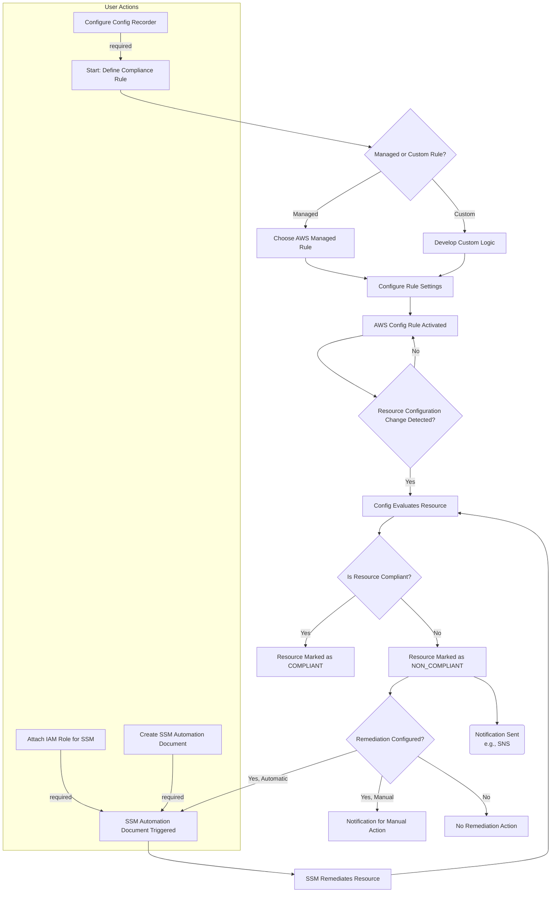

# AWS Config

AWS Config is a service that continuously monitors, records, and evaluates the configurations of your AWS resources for compliance against desired settings.

## Triggers

In AWS Config, there are two primary trigger types for rules:&#x20;

* Configuration changes: The rule is evaluated immediately whenever a resource specified in its scope is created, updated, or deleted. This is ideal for rules that require immediate detection of non-compliant configurations, such as changes to security group rules or S3 bucket policies.
* Periodic: The rule is evaluated on a fixed, timed schedule, regardless of any configuration changes. This is useful for auditing compliance for resources that are not expected to change often, or when you only need to check compliance at regular intervals. The frequency can be configured (e.g., daily, every 12 hours).&#x20;

<figure><figcaption></figcaption></figure>

## Five Use Cases

1. Security Auditing: Tracks security group changes to detect and alert on unrestricted port access.
2. Compliance Enforcement: Automates checks for adherence to regulatory standards like HIPAA or PCI-DSS.
3. Troubleshooting: Provides a configuration history to pinpoint the cause of operational issues after a change.
4. Resource Inventory: Creates a detailed inventory of all resources in an account and their relationships.
5. Cost Management: Tracks changes in resource size or encryption that could impact costs.&#x20;

Most-Used Settings:

* Recorder: Enable the Configuration Recorder to start monitoring resource configurations.
* Recording scope: Define whether to record all resources or specific types.
* Delivery Channel: Specify an S3 bucket to store configuration history and snapshots, and an SNS topic for change notifications.
* Rules: Configure managed or custom rules to evaluate resources for compliance.
* Remediation: Associate a Systems Manager automation document with a rule to automatically fix non-compliant resources.&#x20;

## Flowchart



```mermaid
```
