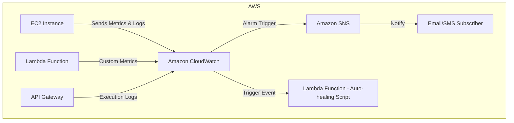

# Cloudwatch

## Definition

CloudWatch is a managed service that collects, stores, and visualizes metrics, logs, and events from AWS resources, applications, and custom sources. It enables dashboards, alarms, anomaly detection, and automated responses to operational changes—providing the foundation for observability, troubleshooting, and performance optimization in AWS environments.

## Common Integrations

* **Input (send data into CloudWatch):**
  * **EC2 / ECS / EKS** – Emit performance metrics and logs.
  * **Lambda** – Send custom metrics, execution logs.
  * **API Gateway** – Push request and execution logs.
  * **RDS / DynamoDB / S3** – Emit operational metrics directly.
* **Process (services that interact with CloudWatch data):**
  * **EventBridge** – Consumes CloudWatch events for routing and automation.
  * **CloudWatch Alarms** – Trigger rules and actions based on thresholds.
* **Output (receives results from CloudWatch):**
  * **SNS** – Distributes notifications via email/SMS/HTTP.
  * **Lambda** – Runs automation scripts (e.g., auto-healing).
  * **Dashboards** – Visualizes metrics and logs for users.

***

## Flowchart

## AWS Services Comparison

| Service                                         | Similarity to CloudWatch                      | Difference from CloudWatch                                                                                                        |
| ----------------------------------------------- | --------------------------------------------- | --------------------------------------------------------------------------------------------------------------------------------- |
| **AWS X-Ray**                                   | Both provide observability into applications. | X-Ray focuses on distributed tracing of requests across services; CloudWatch handles metrics, logs, dashboards, and alarms.       |
| **AWS CloudTrail**                              | Both capture AWS activity data.               | CloudTrail records API calls and user actions for auditing/security; CloudWatch monitors performance, metrics, and logs.          |
| **Amazon Managed Service for Prometheus (AMP)** | Both gather and query monitoring metrics.     | Prometheus is open-source, container-native, better for Kubernetes; CloudWatch is AWS-native, simpler for general AWS monitoring. |

## Cross-Cloud Equivalents

| Cloud Provider   | Similar Service                          | Difference from CloudWatch                                                                                                   |
| ---------------- | ---------------------------------------- | ---------------------------------------------------------------------------------------------------------------------------- |
| **Azure**        | **Azure Monitor**                        | Provides metrics, logs, dashboards, and alerts like CloudWatch; tailored for Azure ecosystem.                                |
| **Google Cloud** | **Cloud Operations Suite (Stackdriver)** | Similar observability stack (metrics, logs, tracing); CloudWatch is AWS-native, Stackdriver is GCP-native.                   |
| **3rd Party**    | **Datadog**                              | Full-stack monitoring with rich visualization and multi-cloud support; CloudWatch is AWS-only and cost-effective within AWS. |
