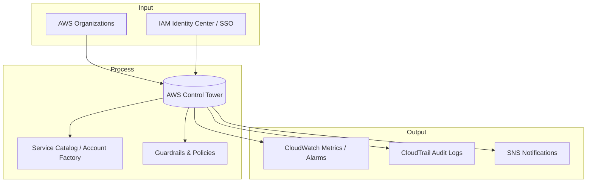

# Control Tower

## **Description**

Control Tower helps organizations set up and govern secure, compliant, multi-account AWS environments. It automates landing zone creation, applies guardrails, enforces policies, and integrates with AWS Organizations to provide centralized visibility, compliance reporting, and best-practice blueprints.

## Capabilities & Where to Configure

| Capability & Description                                                                                             | Pertinent Setting / Location                               |
| -------------------------------------------------------------------------------------------------------------------- | ---------------------------------------------------------- |
| **Landing Zone Setup** — Automatically provisions a multi-account environment with baseline security and networking. | **Control Tower Console → Landing Zone**                   |
| **Organizational Units (OUs)** — Group accounts into OUs for policy and guardrail application.                       | **Control Tower Console → Organizational Units**           |
| **Guardrails** — Pre-packaged rules (mandatory, strongly recommended, or elective) for compliance and security.      | **Control Tower Console → Guardrails**                     |
| **Account Factory** — Automate account provisioning with templates and pre-defined configurations.                   | **Control Tower Console → Account Factory**                |
| **Single Sign-On (IAM Identity Center) Integration** — Centralized access management across accounts.                | **Control Tower Console → Settings → Identity Management** |
| **Dashboard & Compliance Reporting** — Central view of account compliance with guardrails.                           | **Control Tower Console → Dashboard**                      |
| **Audit Logging** — Centralized logging of account activity via CloudTrail and CloudWatch.                           | **Control Tower Console → Audit Logging**                  |
| **Network Baseline** — Pre-configured VPCs, subnets, and security controls for accounts.                             | **Control Tower Console → Network Configurations**         |
| **Lifecycle Management** — Update and maintain landing zones as AWS best practices evolve.                           | **Control Tower Console → Settings → Updates**             |
| **Cross-Account Visibility** — Centralized monitoring of accounts and policy compliance.                             | **Control Tower Console → Dashboard / Organizations**      |

## Common Integrations

## &#x20;

**Input:**

* AWS Organizations (account and OU structure)
* IAM Identity Center / SSO (user and role management)

**Process:**

* Control Tower (policy enforcement and provisioning)
* Service Catalog (account blueprints)

**Output:**

* CloudTrail (audit logging)
* CloudWatch (metrics/alarms)
* SNS (notifications for compliance or events)

## Sample Integration Diagram

## AWS Service Comparisons

<table data-full-width="true"><thead><tr><th>Service</th><th>Similarity</th><th>Difference</th><th>When to Use</th></tr></thead><tbody><tr><td><strong>AWS Organizations</strong></td><td>Multi-account management, central billing, policy control.</td><td>Control Tower automates landing zone setup, guardrails, and account provisioning.</td><td>Use Control Tower for new multi-account environments needing governance and automated setup.</td></tr><tr><td><strong>AWS Service Catalog</strong></td><td>Standardized templates and provisioning.</td><td>Service Catalog is primarily for individual resources or applications; Control Tower uses it for account blueprints.</td><td>Use Service Catalog for resource/application standardization within accounts.</td></tr><tr><td><strong>Landing Zone (manual)</strong></td><td>Multi-account setup with security and network baselines.</td><td>Manual Landing Zones require custom scripting; Control Tower automates setup and updates.</td><td>Use Control Tower to reduce operational overhead and follow AWS best practices.</td></tr><tr><td><strong>AWS Config</strong></td><td>Continuous compliance monitoring.</td><td>Config provides detailed resource-level rules; Control Tower applies pre-packaged organizational guardrails.</td><td>Use Config for fine-grained compliance; Control Tower for organizational-level guardrails.</td></tr></tbody></table>

## Cross-Cloud Equivalents

| Cloud     | Service                                               | Similarity                                                   | Difference                                                                                            |
| --------- | ----------------------------------------------------- | ------------------------------------------------------------ | ----------------------------------------------------------------------------------------------------- |
| **Azure** | Azure Management Groups + Blueprints                  | Multi-account grouping, governance, and template deployment. | Control Tower is more automated with landing zone setup; Azure may require more manual orchestration. |
| **GCP**   | Google Cloud Resource Manager + Organization Policies | Group accounts/projects, enforce organizational policies.    | Less automation in initial setup; Control Tower provides landing zone and guardrails out of the box.  |
| **Azure** | Azure Policy                                          | Compliance enforcement across subscriptions.                 | Control Tower combines multiple policy, SSO, and account provisioning features.                       |
| **GCP**   | Cloud Deployment Manager                              | Infrastructure provisioning via templates.                   | Control Tower bundles provisioning with governance and monitoring for multi-account environments.     |
