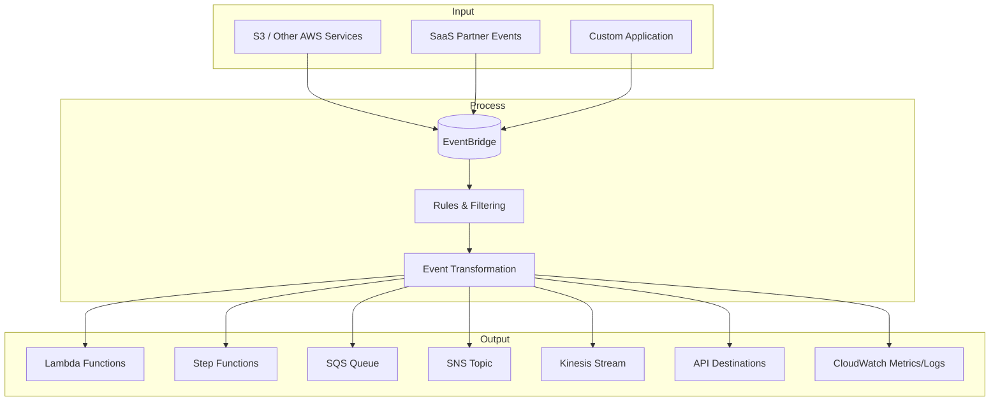

# Event Bridge

## **Description**

EventBridge is a fully managed service that ingests, filters, and routes events from AWS services, SaaS partners, or custom applications. It allows building loosely coupled, event-driven systems with flexible routing, transformation, and triggering of targets like Lambda, Step Functions, or SQS.

## Capabilities & Where to Configure

| Capability & Description                                                                                  | Pertinent Setting / Location                            |
| --------------------------------------------------------------------------------------------------------- | ------------------------------------------------------- |
| **Event Buses** — Central hub to receive events from AWS services, SaaS partners, or custom applications. | **EventBridge Console → Event buses**                   |
| **Rules & Filtering** — Define rules to filter incoming events and route them to targets.                 | **EventBridge Console → Rules → Create rule**           |
| **Event Transformation** — Modify event content before sending to targets.                                | **EventBridge Console → Rules → Input transformer**     |
| **SaaS Partner Integration** — Ingest events directly from supported SaaS providers.                      | **EventBridge Console → Partner event sources**         |
| **Custom Applications** — Send application-generated events to EventBridge via API.                       | **PutEvents API / SDK / CLI**                           |
| **Target Routing** — Deliver events to Lambda, Step Functions, SNS, SQS, Kinesis, or API destinations.    | **EventBridge Console → Rules → Targets**               |
| **Event Replay** — Replay past events for testing or recovery.                                            | **EventBridge Console → Archives → Replay**             |
| **Schema Registry & Discovery** — Store, discover, and generate code bindings for event schemas.          | **EventBridge Console → Schemas → Registry / Discover** |
| **Cross-Account & Cross-Region** — Send events to other accounts or regions.                              | **EventBridge Console → Event buses → Permissions**     |
| **Monitoring & Logging** — Track rule matches, failed deliveries, and metrics.                            | **CloudWatch Metrics / CloudWatch Logs**                |

## Common Integrations

**Input:**

* AWS services (S3, EC2, RDS, CloudWatch events)
* SaaS partners (e.g., Salesforce, Zendesk)
* Custom application events via PutEvents

**Process:**

* EventBridge Rules (filtering, transformation)
* Lambda functions (event processing)
* Step Functions (orchestration)

**Output:**

* SQS, SNS, Kinesis streams
* Lambda / Step Functions
* API Destinations
* CloudWatch metrics/logs

## Sample Integration Diagram

## AWS Service Comparisons

<table data-full-width="true"><thead><tr><th>Service</th><th>Similarity</th><th>Difference</th><th>When to Use</th></tr></thead><tbody><tr><td><strong>SNS</strong></td><td>Event-driven notifications.</td><td>Pub/Sub messaging only; no filtering or transformation.</td><td>Use when simple fan-out notifications are needed.</td></tr><tr><td><strong>SQS</strong></td><td>Event-driven message handling.</td><td>Queue-based storage, no routing or filtering.</td><td>Use for decoupled, reliable message buffering.</td></tr><tr><td><strong>CloudWatch Events (legacy)</strong></td><td>Event triggering from AWS resources.</td><td>EventBridge is the evolution; more flexible, supports SaaS/custom events.</td><td>Use EventBridge for modern event-driven architectures.</td></tr><tr><td><strong>Kinesis Data Streams</strong></td><td>Event ingestion and processing.</td><td>Designed for high-throughput streaming; not for general routing of discrete events.</td><td>Use for real-time data streaming and analytics.</td></tr><tr><td><strong>Step Functions</strong></td><td>Orchestration triggered by events.</td><td>EventBridge triggers Step Functions; Step Functions manage workflows.</td><td>Use when orchestrating multi-step processes or state machines.</td></tr></tbody></table>

## Cross-Cloud Equivalents

| Cloud     | Service                       | Similarity                                              | Difference                                                                            |
| --------- | ----------------------------- | ------------------------------------------------------- | ------------------------------------------------------------------------------------- |
| **Azure** | Event Grid                    | Event-driven routing with filtering and transformation. | Similar features, integrates with Azure Functions and Logic Apps.                     |
| **GCP**   | Eventarc                      | Central event router for GCP services and SaaS.         | Fully managed, integrates with Cloud Run, Pub/Sub, and Cloud Functions.               |
| **Azure** | Service Bus (Topics / Queues) | Event/message delivery.                                 | Queue/topic-focused, less flexible than EventGrid for multi-target routing.           |
| **GCP**   | Pub/Sub                       | Event/message distribution.                             | Pub/Sub handles messaging but lacks schema registry or input transformation natively. |
