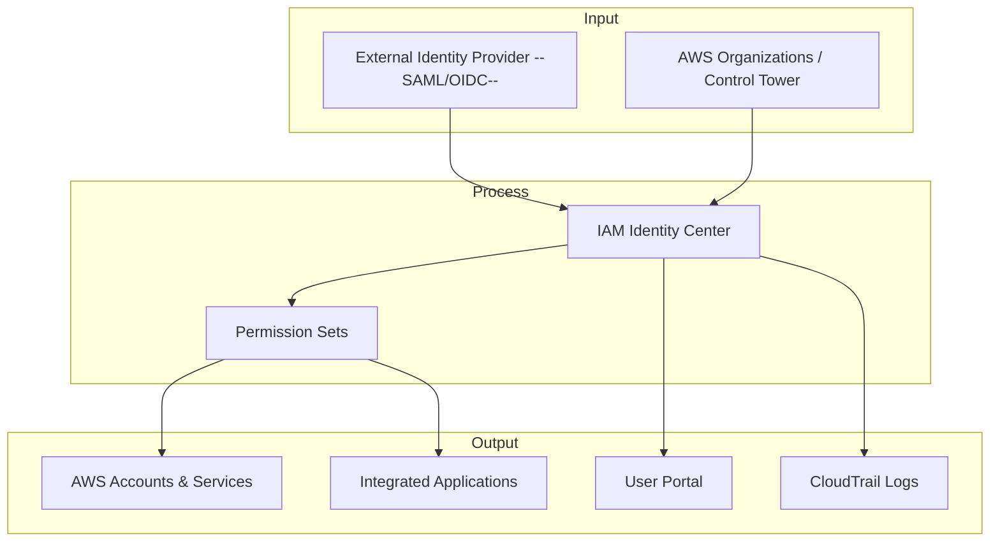

# IAM Identity Center

## **Description**

IAM Identity Center allows organizations to manage user access to AWS accounts, applications, and services from a central location. It integrates with AWS Organizations and Control Tower, enabling permission sets, SSO login, and consistent access management while supporting external identity providers (like Microsoft AD or SAML-based IdPs).

## Capabilities & Where to Configure

| Capability & Description                                                                                         | Pertinent Setting / Location                                             |
| ---------------------------------------------------------------------------------------------------------------- | ------------------------------------------------------------------------ |
| **Single Sign-On (SSO)** — Centralized login for AWS accounts and applications using one set of credentials.     | **IAM Identity Center Console → Settings → User Portal**                 |
| **Permission Sets** — Define a collection of IAM policies to assign users/groups across multiple accounts.       | **IAM Identity Center Console → Permission sets**                        |
| **User & Group Management** — Create or sync users and groups from external IdPs or AWS Managed AD.              | **IAM Identity Center Console → Users & Groups**                         |
| **Account Assignments** — Map users/groups and permission sets to specific AWS accounts or organizational units. | **IAM Identity Center Console → AWS Accounts → Assign users**            |
| **External Identity Provider Integration** — Connect SAML 2.0 or OIDC IdPs for corporate directory integration.  | **IAM Identity Center Console → Settings → Identity Source**             |
| **Multi-Factor Authentication (MFA)** — Enforce MFA for added security on SSO login.                             | **IAM Identity Center Console → Settings → Multi-factor authentication** |
| **Session Management** — Configure session duration and relay state for user logins.                             | **IAM Identity Center Console → Permission sets / Settings**             |
| **Audit Logging** — Track user sign-ins, permission usage, and account activity via CloudTrail.                  | **CloudTrail Console → IAM Identity Center Events**                      |
| **Application Access** — Provide SSO access to cloud applications integrated via SCIM/SAML.                      | **IAM Identity Center Console → Applications**                           |
| **Self-Service User Portal** — Users can see assigned accounts and apps and log in from a single portal.         | **IAM Identity Center User Portal URL**                                  |

## Common Integrations

**Input:**

* Corporate identity sources (Active Directory, Azure AD, SAML IdPs)
* AWS Organizations (accounts and OUs)

**Process:**

* IAM Identity Center (user authentication, access assignment)
* Permission Sets (define access)

**Output:**

* AWS accounts (EC2, S3, RDS, Lambda, etc.)
* AWS Control Tower (account governance)
* CloudTrail (audit logging)
* User Portal (SSO access to apps)

## Sample Integration Diagram

## AWS Service Comparisons

<table data-full-width="true"><thead><tr><th>Service</th><th>Similarity</th><th>Difference</th><th>When to Use</th></tr></thead><tbody><tr><td><strong>AWS Single Sign-On (legacy)</strong></td><td>Centralized login for multiple AWS accounts.</td><td>IAM Identity Center is the new branding with additional features like improved permission sets and user portal.</td><td>Use IAM Identity Center for modern SSO and multi-account access.</td></tr><tr><td><strong>AWS Organizations (IAM integration)</strong></td><td>Multi-account access management.</td><td>Organizations manages accounts and policies; IAM Identity Center manages actual user access via permission sets.</td><td>Use Identity Center to assign users to accounts; Organizations for account structure.</td></tr><tr><td><strong>AWS Directory Service (AD Connector / Managed AD)</strong></td><td>Central identity management.</td><td>Directory Service focuses on Windows AD integration; Identity Center handles SSO and cloud access.</td><td>Use Identity Center to provide SSO across accounts and apps.</td></tr><tr><td><strong>IAM Users &#x26; Groups</strong></td><td>Identity management and access control.</td><td>IAM is per-account; Identity Center centralizes multi-account access.</td><td>Use Identity Center for multi-account environments to reduce per-account IAM user sprawl.</td></tr></tbody></table>

## Cross-Cloud Equivalents

| Cloud             | Service                                     | Similarity                                                            | Difference                                                                 |
| ----------------- | ------------------------------------------- | --------------------------------------------------------------------- | -------------------------------------------------------------------------- |
| **Azure**         | Azure Active Directory (AAD) + Azure AD SSO | Centralized SSO and identity management across apps and resources.    | Fully integrated with Microsoft ecosystem; can manage Azure and SaaS apps. |
| **GCP**           | Google Cloud Identity & SSO                 | Centralized user access and authentication for Google Cloud and apps. | Integrated with Google Workspace; similar SSO capabilities.                |
| **Okta**          | Okta Identity Cloud                         | SaaS identity provider with SSO and user lifecycle management.        | Vendor-neutral; integrates with multiple cloud providers.                  |
| **Ping Identity** | PingOne / PingFederate                      | Enterprise identity management and SSO.                               | Vendor-neutral; supports hybrid cloud and on-premises SSO.                 |
