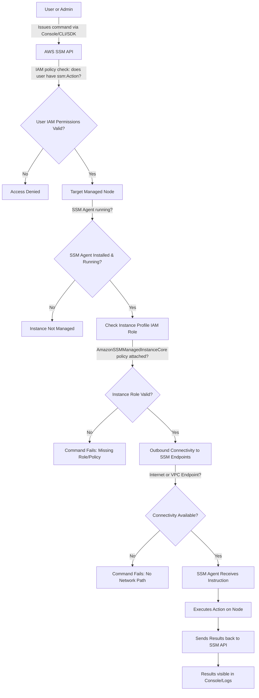

# Installation & Permission


prompt: what things do i need to keep in mind about how systems manager is installed, and permissions


Here’s a clear rundown of what you need to keep in mind about **AWS Systems Manager (SSM) installation and permissions** — both important for exam prep (e.g., AWS DevOps Pro, SysOps):

***

## Installation / Enablement

* **SSM Agent**
  * Preinstalled on most modern Amazon Linux, Ubuntu, and Windows AMIs.
  * On older AMIs, on-premises servers, and other-cloud VMs, you must install it manually.
  * Needs to be kept **updated** (some features require the latest agent).
* **Hybrid Activations**
  * To manage non-EC2 machines, you must create an activation (ID + code) in Systems Manager.
  * This registers the machine as a **managed node** in your account.
* **Network Connectivity**
  * Managed nodes need outbound access to SSM service endpoints (`ssm`, `ec2messages`, `ssmmessages`) either through the internet, VPC endpoints, or a proxy.
  * For fully private subnets, you must set up **VPC Interface Endpoints (PrivateLink)**.

***

## Permissions (IAM)

* **Instance Profile Role (EC2)**
  * Attach an **IAM role** with the `AmazonSSMManagedInstanceCore` managed policy to the EC2 instance.
  * This grants permission for the agent to register with SSM, receive commands, and send logs/telemetry.
* **Service Role (Automation / Patch / State Manager)**
  * Some features (e.g., Automation runbooks, Patch Manager, Distributor) may need an **IAM service role** that Systems Manager assumes to perform actions on your behalf.
* **User Permissions**
  * Admins or operators who use SSM (Run Command, Session Manager, Patch Manager, etc.) need IAM policies granting access to the relevant API actions.
  * Example: To start a Session Manager session, the user must have `ssm:StartSession`.
  * Access can be scoped by **tag-based targeting** or by specific managed instances.

***

## Exam Gotchas

* **Agent + Role** → If either is missing or misconfigured (no outbound connectivity, missing `AmazonSSMManagedInstanceCore`), the node will show as **not managed**.
* **Session Manager** → Requires no inbound SSH/RDP if configured correctly, but **CloudWatch/ S3 logging** requires extra IAM permissions.
* **Hybrid environments** → Remember to mention **activation codes** and **Advanced-Instances Tier** for >1,000 non-EC2 nodes.
* **Least Privilege** → AWS best practice is to **separate user IAM policies** (who can run SSM commands) from **node IAM roles** (permissions for the agent itself).

***

## Flow

