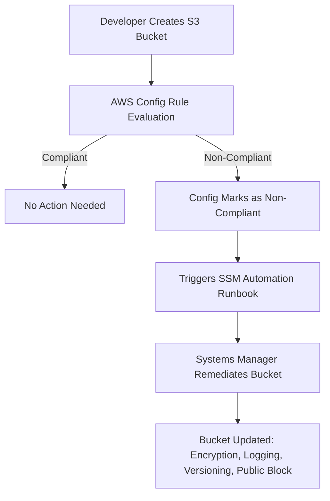

# Usage Example

## Config + Automation

Good question—this is the kind of scenario that ties **AWS Config** (for detection & compliance) with **Systems Manager** (for remediation/automation). Let’s break it down clearly:

***

#### Step 1: Use AWS Config to Detect & Enforce Compliance

AWS Config provides **rules** that continuously evaluate S3 buckets. For your requirements:

* **Encryption** → Use the managed rule `s3-bucket-server-side-encryption-enabled`.
* **Logging** → Use the managed rule `s3-bucket-logging-enabled`.
* **Versioning** → Use the managed rule `s3-bucket-versioning-enabled`.
* **Block Public Access** → Use the managed rule `s3-bucket-public-read-prohibited` and `s3-bucket-public-write-prohibited`.

You can combine these into a **conformance pack** so every account/region applies the same standards automatically.

***

#### Step 2: Remediate with AWS Systems Manager

Config can trigger **automatic remediation actions** using Systems Manager Automation documents (SSM documents, aka runbooks).\
Examples:

* **Enable Encryption** → Runbook `AWS-EnableS3BucketEncryption`
* **Enable Logging** → Runbook `AWS-ConfigureS3BucketLogging`
* **Enable Versioning** → Runbook `AWS-EnableS3BucketVersioning`
* **Block Public Access** → Runbook `AWS-DisableS3BucketPublicReadWrite`

Flow:

1. Config rule evaluates → finds non-compliant bucket.
2. Config triggers an **SSM Automation runbook**.
3. Systems Manager executes the corrective action on the bucket.

***

#### Step 3: Enforce Going Forward

* Apply an **SCP (Service Control Policy)** at the Org level (if using AWS Organizations) to block creation of public S3 buckets.
* Or use **S3 Block Public Access** at the account level, so even future buckets cannot be made public.
* Config ensures **drift detection**; Systems Manager ensures **remediation**.

***

#### Exam-style Flow Diagram

***

**Key Exam Tip:**

* Config = _detect + evaluate compliance_.
* Systems Manager = _remediate + automate fixes_.
* For preventive control, combine with **SCPs** and **S3 Block Public Access**.

***

### Alternatives

Yes — there are a few **alternatives** to using the **Config + Systems Manager combo** for enforcing and remediating S3 security controls. Which one you’d use depends on whether you want **preventive** vs **detective/remediative** controls.

***

#### 1. **Service Control Policies (SCPs) + S3 Block Public Access**

* **How it works:**
  * SCPs (via AWS Organizations) prevent accounts from creating buckets without encryption, versioning, or with public ACLs.
  * S3 Block Public Access at the **account level** ensures no buckets can be made public.
* **Pros:** Preventive, strong guardrail at org/account level.
* **Cons:** Doesn’t retroactively fix existing buckets, only blocks new noncompliant behavior.

***

#### 2. **S3 Bucket Policies + IAM Permissions**

* **How it works:**
  * Define a restrictive bucket policy template (e.g., enforce `"s3:x-amz-server-side-encryption": "AES256"`).
  * Use IAM conditions like `s3:ExistingObjectTag`, `aws:RequestTag`, or `s3:x-amz-server-side-encryption`.
* **Pros:** Enforces encryption and prevents public access at the bucket level.
* **Cons:** Developers can still create buckets without policies unless restricted by SCPs.

***

#### 3. **CloudFormation Guard (cfn-guard) + IaC Pipelines**

* **How it works:**
  * Use **cfn-guard** in CI/CD pipelines to validate CloudFormation/Terraform templates before deployment.
  * Enforce rules like “all S3 buckets must have versioning enabled.”
* **Pros:** Preventive at deployment time; shifts compliance **left**.
* **Cons:** Doesn’t fix buckets created manually in the console/CLI.

***

#### 4. **Security Hub + EventBridge + Lambda**

* **How it works:**
  * Security Hub consolidates findings from Config and GuardDuty.
  * EventBridge detects a noncompliant S3 finding and triggers a **Lambda** to remediate (enable versioning, encryption, etc.).
* **Pros:** Flexible, near real-time, centralized security posture.
* **Cons:** More custom coding/ops overhead vs Config+SSM automation.

***

#### Quick Comparison

| Approach                             | Preventive vs Remediative | Covers Existing Buckets? | Effort Level |
| ------------------------------------ | ------------------------- | ------------------------ | ------------ |
| **Config + SSM**                     | Detective + Remediative   | Yes                      | Medium       |
| **SCP + Block Public Access**        | Preventive                | No (only new)            | Low          |
| **Bucket Policies + IAM Conditions** | Preventive                | Partial                  | Medium       |
| **cfn-guard + IaC**                  | Preventive (pipeline)     | No                       | Medium       |
| **Security Hub + Lambda**            | Detective + Remediative   | Yes                      | High         |
