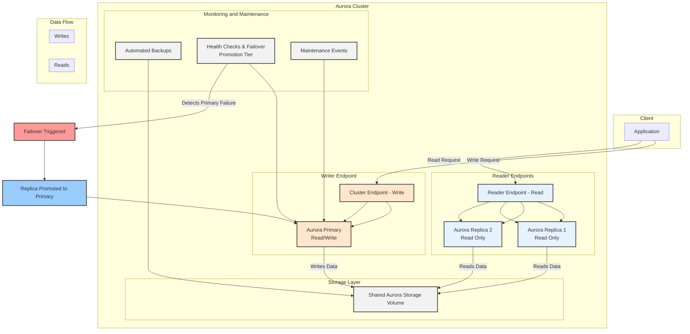

# Data Flowchart

```mermaid
graph TD
    subgraph Client
        direction LR
        A[Application]
    end

    subgraph Aurora Cluster
        subgraph Reader Endpoints
            direction LR
            D[Reader Endpoint - Read] --> E[Aurora Replica 1 <br/> Read Only]
            D --> F[Aurora Replica 2 <br/> Read Only]
        end

        subgraph Writer Endpoint
            direction TB
            B[Cluster Endpoint - Write] --> C[Aurora Primary <br/> Read/Write]
        end

        subgraph Storage Layer
            direction LR
            G[Shared Aurora Storage Volume]
        end

        subgraph Monitoring and Maintenance
            direction LR
            H[Automated Backups] --> G
            I[Health Checks & Failover <br/> Promotion Tier] --> C
            J[Maintenance Events] --> C
        end
    end

    A -- Write Request --> B
    A -- Read Request --> D
    C -- Writes Data --> G
    E -- Reads Data --> G
    F -- Reads Data --> G

    I -- "Detects Primary Failure" --> K[Failover Triggered]
    K --> L[Replica Promoted to Primary]
    L --> C

    subgraph "Data Flow"
        subgraph "Reads"
            D --> E
            D --> F
        end
        subgraph "Writes"
            B --> C
        end
    end

    style K fill:#ff9999,stroke:#333,stroke-width:2px
    style L fill:#99ccff,stroke:#333,stroke-width:2px
    style B fill:#ffe6cc,stroke:#333,stroke-width:2px
    style D fill:#e6f2ff,stroke:#333,stroke-width:2px
    style C fill:#ffe6cc,stroke:#333,stroke-width:2px
    style E fill:#e6f2ff,stroke:#333,stroke-width:2px
    style F fill:#e6f2ff,stroke:#333,stroke-width:2px
    style G fill:#f2f2f2,stroke:#333,stroke-width:2px
    style H fill:#f2f2f2,stroke:#333,stroke-width:2px
    style I fill:#f2f2f2,stroke:#333,stroke-width:2px
    style J fill:#f2f2f2,stroke:#333,stroke-width:2px
```
