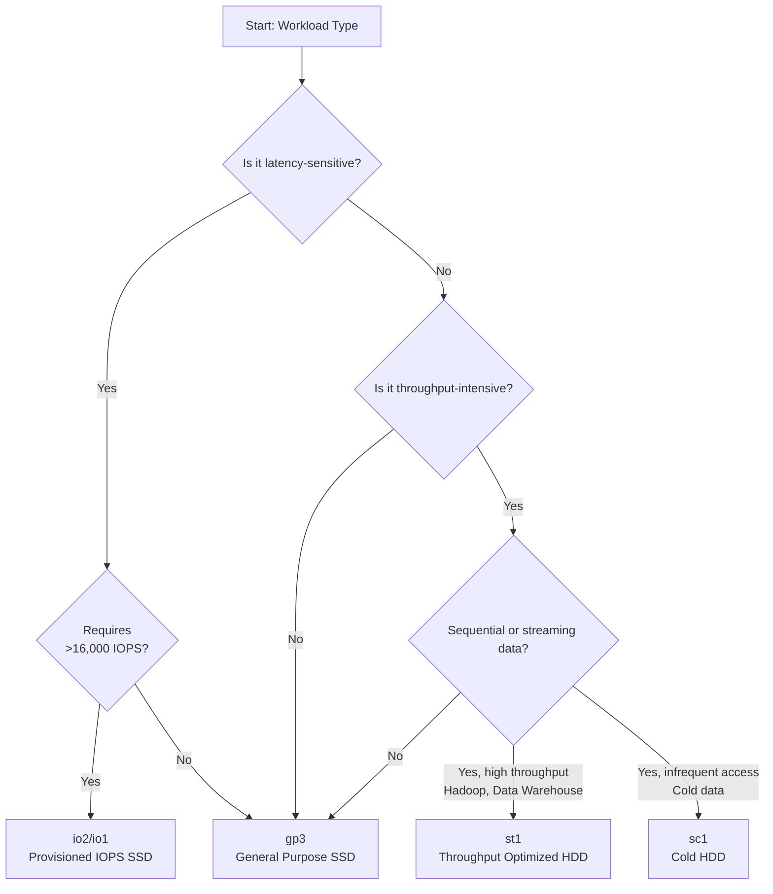

# EBS

## AWS Docs



### Volume Types









```mermaid
flowchart TD

A[Start: Workload Type] --> B{Is it latency-sensitive?}
B -->|Yes| C{Requires<br/>>16,000 IOPS?}
B -->|No| D{Is it throughput-intensive?}

C -->|Yes| E[io2/io1<br/>Provisioned IOPS SSD]
C -->|No| F[gp3<br/>General Purpose SSD]

D -->|Yes| G{Sequential or streaming data?}
D -->|No| F

G -->|Yes, high throughput<br/>Hadoop, Data Warehouse| H[st1<br/>Throughput Optimized HDD]
G -->|Yes, infrequent access<br/>Cold data| I[sc1<br/>Cold HDD]
G -->|No| F


```
