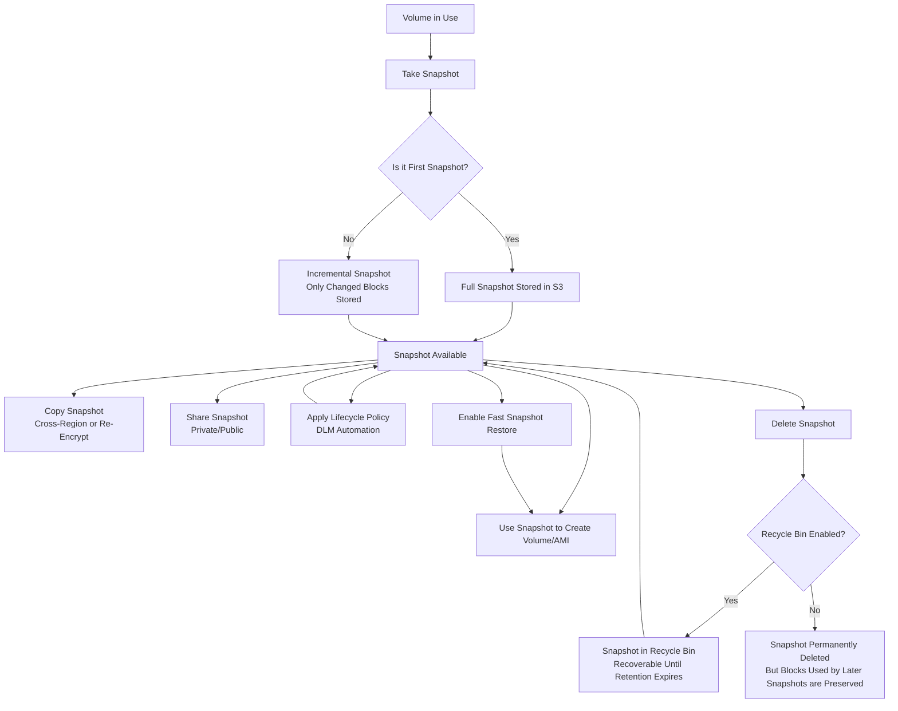

# Snapshots

## AWS Docs



### EventBridge events





### Lifecycle





### Block public access





### What an EBS Snapshot Is

* A point-in-time, incremental backup of an EBS volume.
* Stored in Amazon S3 (managed and hidden from you — you can’t browse it like a normal S3 bucket).
* Can be used to create new EBS volumes, copy across Regions, or share with other accounts.

***

### Lifecycle

### Key Characteristics

* **Incremental**: After the first snapshot, only changed blocks are saved. Saves storage and time.
* **Durable**: Stored redundantly in S3 with 11 nines of durability.
* **Region-specific**: Snapshots are bound to a region but can be copied across regions.
* **Crash-consistent**: Snapshots capture all blocks at the point in time, but may not guarantee application consistency unless coordinated.

***

### Features and Advanced Options

1. **Fast Snapshot Restore (FSR)**
   * Allows restoring a snapshot so the volume is fully initialized immediately.
   * Normally, restored volumes use lazy loading (initial read can be slow).
   * Good for latency-sensitive workloads.
2. **EBS Snapshot Lifecycle Manager (DLM)**
   * Automates creation, retention, and deletion of snapshots based on policies.
   * Useful for compliance and cost management.
3. **Snapshot Sharing**
   * Snapshots can be shared with specific AWS accounts or made public.
   * Public snapshots often appear in exam questions as a data leakage risk.
4. **Snapshot Copy**
   * Copy snapshots across regions for disaster recovery or migration.
   * Can also change encryption state (copy an unencrypted snapshot to an encrypted one).
5. **Recycle Bin for Snapshots**
   * Lets you set retention policies so snapshots deleted accidentally can be recovered within a set period.

***

### Common Exam Scenarios

* **Cross-Region DR**: Copy snapshots to another region, then create volumes there.
* **Cross-Account Access**: Share snapshot with another account so they can create volumes.
* **Backup Automation**: Use Data Lifecycle Manager to create recurring snapshots.
* **Encryption**: Snapshots inherit the encryption of the source volume, but you can also re-encrypt when copying.
* **Restore Performance**: Use Fast Snapshot Restore for workloads that can’t tolerate lazy initialization.
* **Migration**: Move a workload by snapshotting a volume, copying across regions, and creating a new volume.

***

### Exam Tips

* Snapshots are **volume-level**, not instance-level. If you need an instance backup, use AMI creation (which includes snapshots of all attached volumes).
* Snapshot storage costs are based on the amount of data stored, not the logical size of the volume.
* Deleting a snapshot does not necessarily delete blocks if they are referenced by newer snapshots (chain-based).
* Snapshots are always stored in S3, but you do not interact with them as S3 objects.
* For compliance-driven questions, remember DLM and Recycle Bin.
