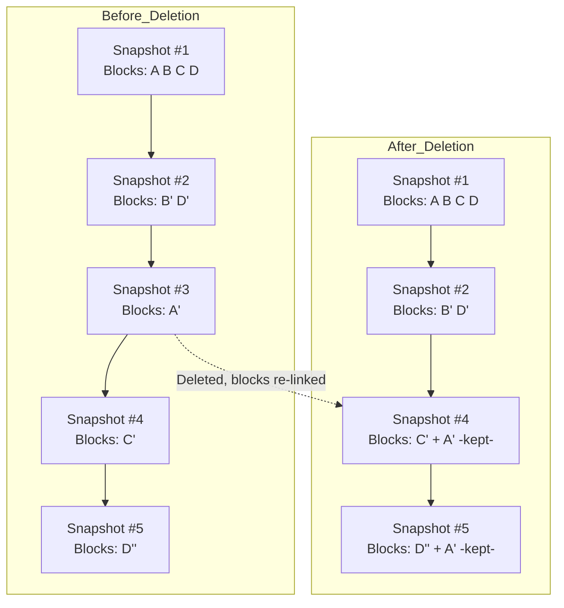

# whys

## Corruption


okay, if it is incremental, and there are 5 snapshots saved, what will happen if i delete the 3rd? will it corrupt the 4th and 5th?


#### How Incremental Snapshots Work

* Each snapshot after the first only saves the blocks that have changed since the **previous snapshot**.
* But — each snapshot is a **self-contained view** of the volume at the time it was taken. AWS handles the block mapping behind the scenes.

***

#### What Happens If You Delete Snapshot #3 (out of 5)

* AWS checks which blocks in snapshot #3 are **still needed** by later snapshots (#4 and #5).
* If a block is needed, AWS automatically preserves it by associating it with a later snapshot.
* Then snapshot #3 is deleted as a reference point.

Result:

* Snapshots #4 and #5 remain intact and usable.
* You lose nothing — AWS re-maps the block references as needed.
* Only the unique, unreferenced data blocks in snapshot #3 are actually removed from storage.

***

### Flow

### Exam Tip

* Deleting a snapshot **does not corrupt the snapshot chain**.
* Every snapshot is a complete, restorable volume, regardless of whether earlier snapshots still exist.
* The only effect is on storage cost: blocks unique to the deleted snapshot are freed.
