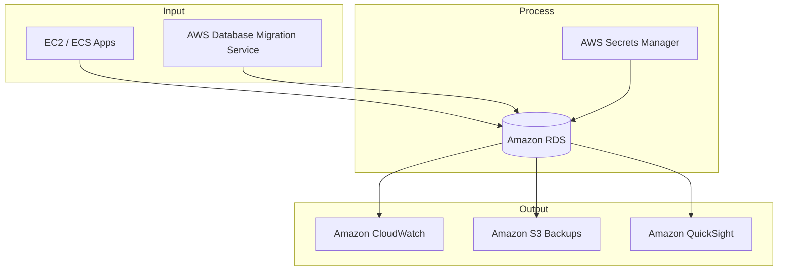

# RDS

## **Description**

Amazon RDS automates database setup, patching, scaling, and backups for popular relational engines (MySQL, PostgreSQL, MariaDB, Oracle, SQL Server, and Aurora). It reduces operational overhead while maintaining high availability, durability, and integration with AWS ecosystem services.

## Capabilities & Where to Configure

| Capability & Description                                                                                                   | Pertinent Setting / Location                            |
| -------------------------------------------------------------------------------------------------------------------------- | ------------------------------------------------------- |
| **Multi-AZ Deployment** — Provides high availability by automatically replicating data across multiple Availability Zones. | **RDS Console → Create DB → Availability & durability** |
| **Read Replicas** — Scale read-heavy workloads by creating replicas of the primary DB.                                     | **RDS Console → Databases → Create read replica**       |
| **Automated Backups** — Continuous backups with point-in-time recovery.                                                    | **RDS Console → Databases → Maintenance & backups**     |
| **Database Engine Choice** — Supports multiple engines: MySQL, PostgreSQL, Oracle, SQL Server, MariaDB, Aurora.            | **RDS Console → Create database → Engine options**      |
| **Security (IAM, KMS, VPC)** — Control access with IAM, encrypt with KMS, isolate in VPC.                                  | **RDS Console → Connectivity & security**               |
| **Monitoring (CloudWatch, Enhanced)** — Track metrics like CPU, memory, connections.                                       | **RDS Console → Monitoring**                            |
| **Scaling (Vertical/Horizontal)** — Change instance size or use Aurora for autoscaling.                                    | **RDS Console → Modify DB instance**                    |
| **Maintenance & Patching** — Automatic updates with maintenance windows.                                                   | **RDS Console → Databases → Maintenance**               |
| **Performance Insights** — Visualize query performance and DB load.                                                        | **RDS Console → Performance Insights**                  |

***

## Common Integrations

### **Input**

* Application servers (EC2, ECS, Lambda)
* AWS DMS (migrations into RDS)

### **Process**

* RDS (relational data storage & processing)
* Secrets Manager (credential management)

### **Output**

* CloudWatch (metrics & alarms)
* S3 (backup export / snapshots)
* QuickSight (analytics dashboards)

## Flowchart

## AWS Service Comparisons

<table data-full-width="true"><thead><tr><th>Service</th><th>Similarity</th><th>Difference</th><th>When to Use</th></tr></thead><tbody><tr><td><strong>Amazon Aurora</strong></td><td>Managed relational database, MySQL/Postgres compatible, integrates with RDS features.</td><td>Cloud-native DB, faster replication, autoscaling, storage up to 128 TB, designed for high performance.</td><td>Use for enterprise-grade apps needing high throughput, global scale, and modern cloud-native design.</td></tr><tr><td><strong>Amazon Redshift</strong></td><td>Both store structured data and support SQL queries.</td><td>Redshift is a data warehouse optimized for OLAP, not OLTP.</td><td>Use for analytics, BI, and reporting across massive datasets.</td></tr><tr><td><strong>Amazon DynamoDB</strong></td><td>Both are managed AWS databases.</td><td>DynamoDB is NoSQL (key-value/document), not relational.</td><td>Use when you need single-digit ms latency at scale, with flexible schema.</td></tr><tr><td><strong>Amazon Neptune</strong></td><td>Both are managed DB services with integrations (IAM, VPC, CloudWatch).</td><td>Neptune is a graph database for relationships between data.</td><td>Use when modeling networks, social graphs, recommendation engines.</td></tr><tr><td><strong>Amazon DocumentDB</strong></td><td>Managed database with automated scaling and backups.</td><td>DocumentDB is MongoDB-compatible, NoSQL document model.</td><td>Use when you need semi-structured data with JSON-like documents.</td></tr></tbody></table>

## Cross-Cloud Equivalents

| Cloud     | Service                             | Similarity                                                 | Difference                                                 |
| --------- | ----------------------------------- | ---------------------------------------------------------- | ---------------------------------------------------------- |
| **Azure** | Azure SQL Database                  | Fully managed relational DB with scaling and HA.           | Strong integration with Microsoft ecosystem, T-SQL focus.  |
| **Azure** | Azure Database for PostgreSQL/MySQL | Managed open-source engines with autoscaling.              | Azure-native management and billing.                       |
| **GCP**   | Cloud SQL                           | Managed MySQL, PostgreSQL, SQL Server with backups and HA. | Regionally scoped (not global like Aurora Global DB).      |
| **GCP**   | AlloyDB for PostgreSQL              | High-performance Postgres-compatible service.              | Built for cloud-native scaling and analytics acceleration. |
