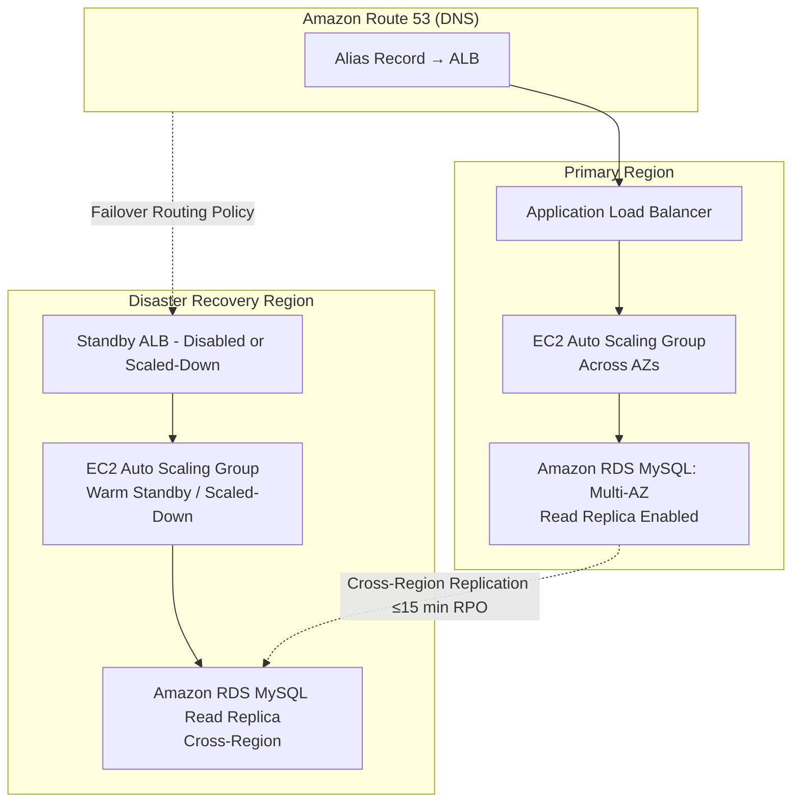

# Questions

## EC2 + ALB + R53

<figure><figcaption></figcaption></figure>



#### **Pertinent Settings**

1. **Route 53**
   * Configure **Failover Routing Policy**:
     * Primary → ALB in primary region
     * Secondary → ALB in DR region
   * Enable **Health Checks** for ALB.
2. **EC2 + Auto Scaling**
   * **Primary Region**:
     * ASG sized for production load.
     * ALB with HTTPS listener, security groups allowing inbound from internet.
   * **DR Region**:
     * ASG in **warm standby mode** (minimal instances, scale-up on failover).
     * Preconfigured launch templates, IAM roles, and security groups.
3. **RDS**
   * **Primary Region**: Multi-AZ RDS MySQL for HA.
   * **Cross-Region Read Replica** in DR region.
   * Ensure replication lag ≤15 minutes to meet **RPO = 15 min**.
4. **Disaster Recovery Objectives**
   * **RTO (4 hours)**:
     * Warm standby allows scaling and promotion of DB replica within timeframe.
   * **RPO (15 minutes)**:
     * Achieved by cross-region RDS replication.

```
```
